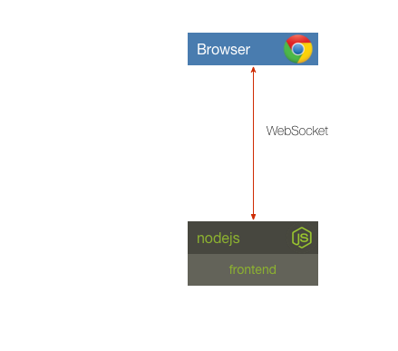

## Challenge 1

Your challenge is to start the frontend so that it's listening on port 10001. Verify the results by pointing your browser to [http://localhost:10001](). You should see a chart. Simple!

__hint__ the frontend expects an environment variable named PORT

## Next Up: [Challenge 2](../challenge2/README.md)
