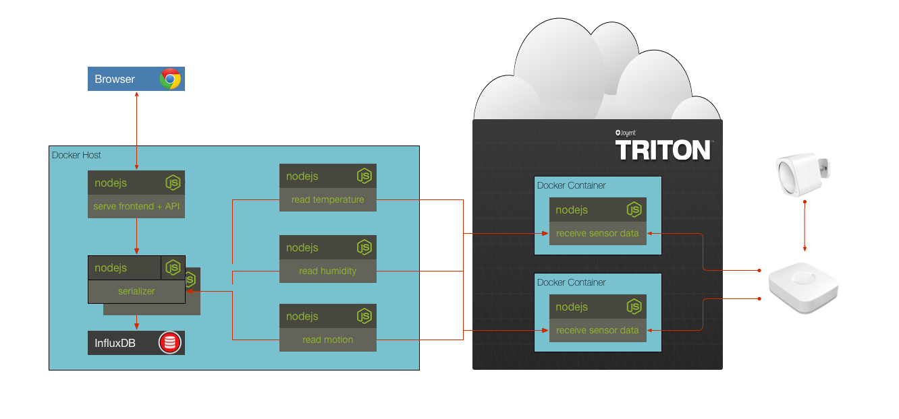

## Solution to Challenge 9

1. Add the following to the `docker-compose.yml` file

  ```
motion:
  build: ./motion
  links:
    - serializer:serializer
  environment:
    - SERIALIZER_HOST=serializer
    - SERIALIZER_PORT=10000
  restart: always
  env_file:
    - sensors.env
  ```
2. Add the following to the humidity and temperature sections of the `docker-compose.yml` file

  ```
env_file:
    - sensors.env
  ```
3. Build and run the containers `docker-compose up -d`
4. Point your browser to [http://localhost:10001/]() to see the chart.

Stop the containers by using the `docker-compose down`.


## Challenge 10



There are quite a few services depending on the serializer. For this challenge, scale the serializer out to 2 instances using `docker-compose scale serializer=2`. Alter the `docker-compose.yml` file so that the serializer isn't port mapping to the same external port of 10000.

__hint__ read the documentation on docker [ports](https://docs.docker.com/compose/compose-file/#/ports)


## Next Up: [Challenge 11](../challenge11/README.md)
