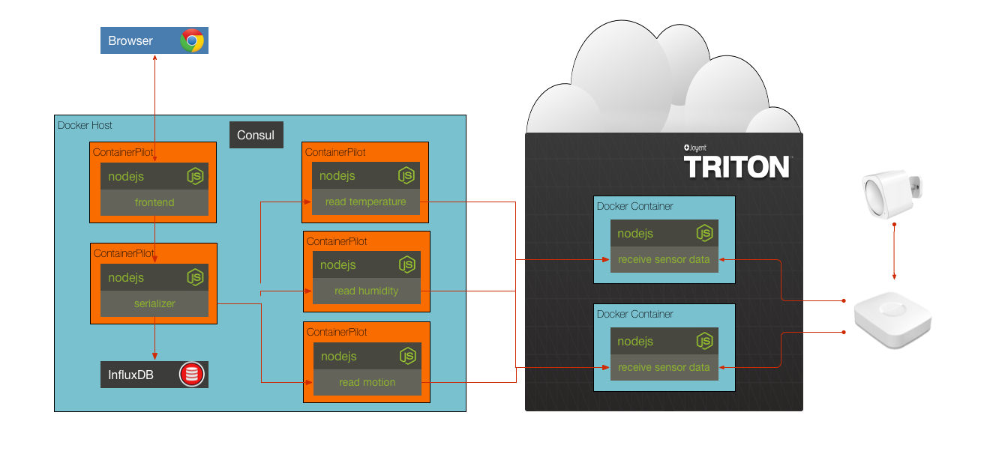

## Solution to Challenge 10

1. Change the serializer entry in the `docker-compose.yml` file

  from
  ```
ports:
  - "10000:10000"
  ```

  to

  ```
ports:
  - "10000"
  ```
2. Build and run the containers `docker-compose up -d`
3. Scale the serializer with `docker-compose scale serializer=2`
4. Uh oh, nothing knows about the second serializer instance!

Stop the containers by using the `docker-compose down`.

Open the slides and read learn about Consul & ContainerPilot


## Challenge 11




Each service is now using ContainerPilot and has health monitoring configured. Additionally, each service now has the dependent services configured. Your challenge is to update the `docker-compose.yml` file to link the consul service and set the `CONSUL_HOST` environment variable for each of the services (not consul itself).


## Next Up: [final](../final/README.md)
