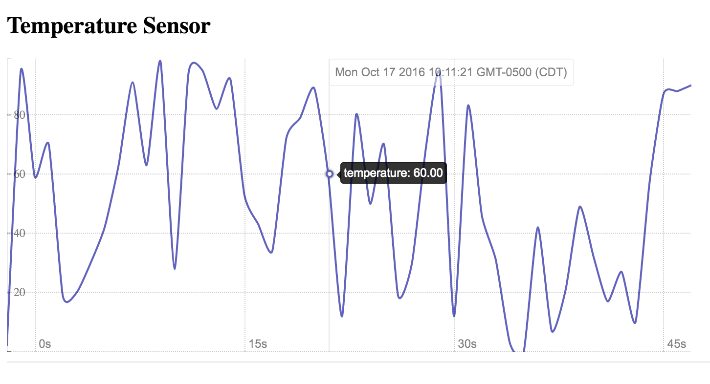

# Solution to Challenge 1

```sh
cd frontend/
PORT=10001 node .
```

Point your browser to [http://localhost:10001](). You should see a chart, like the one shown here:



## Challenge 2


Next we are going to start our database. To do this we are going to take advantage of [Docker](https://docs.docker.com/engine/installation/). If you haven't done this already you can fetch the InfluxDB container by running:

```sh
docker pull tutum/influxdb
```

Documentation on how to start the container can be found [here](https://hub.docker.com/r/tutum/influxdb/).

Your challenge is to startup the InfluxDB container and initialize it with a `sensors` database. Once you have it running successfully, open your browser and review the influx web interface.

__hint__ new databases can be created with `PRE_CREATE_DB` environment variable

__hint__ the InfluxDB dashboard is listening on port 8083


## Next Up: [Challenge 3](../challenge3/README.md)
