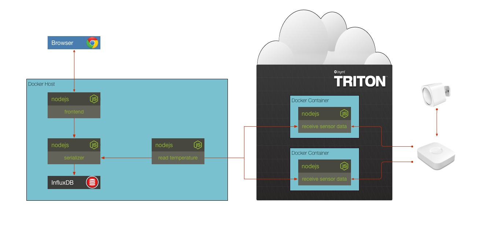

## Solution to Challenge 6

1. Build the images and run the containers with docker-compose:

  ```sh
  docker-compose up -d
  ```
2. Point your browser to [http://localhost:10001/]() to see the chart.
3. Write data to the serializer using the `serializer/testWrite.sh` script.

Stop the containers by using the `docker-compose down`.


## Challenge 7



Instead of relying on random temperature data, we will connect a microservice to a data feed coming from a [Samsung SmartThings](http://smartthings.com/) hub. The hub is networked using the z-wave protocol to a MultiSensor. A custom app runs on the hub that handles temperature events and forwards them to a server running in a docker container on [Triton](https://www.joyent.com/triton).

For this challenge, add an entry to the `docker-compose.yml` for the temperature microservice and configure it to connect to the SmartThings service running on Triton.

__hint__ If you look at the temperature service code you will see that it uses the following environment variables:

* `SERIALIZER_HOST`
* `SERIALIZER_PORT`
* `SMARTTHINGS_HOST=smartthings.svc.30f62ec2-24a2-6f8e-8fad-d46b04c8a0b9.us-sw-1.triton.zone`
* `SMARTTHINGS_PORT=8000`

__hint__ use `docker-compose logs -f` to see the logs

__hint__ use `docker-compose up -d --build` to rebuild and run


## Next Up: [Challenge 8](../challenge8/README.md)
