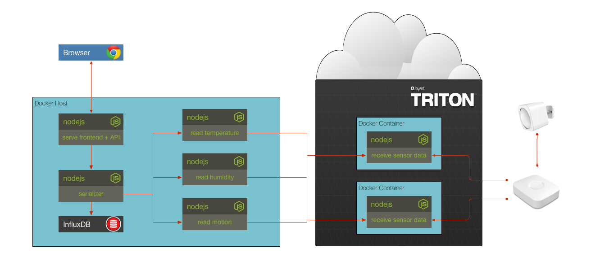

## Solution to Challenge 8

1. Add the following to the `docker-compose.yml` file

```
  humidity:
    build: ./humidity
    links:
      - serializer:serializer
    environment:
      - SERIALIZER_HOST=serializer
      - SERIALIZER_PORT=10000
      - SMARTTHINGS_HOST=smartthings.svc.30f62ec2-24a2-6f8e-8fad-d46b04c8a0b9.us-sw-1.triton.zone
      - SMARTTHINGS_PORT=8000
    restart: always
```

2. Build and run the containers `docker-compose up -d`
3. Point your browser to [http://localhost:10001/]() to see the chart.

Stop the containers by using the `docker-compose down`.


## Challenge 9



The frontend is updated with a chart for 'motion', and now there is a new motion service that behaves like the temperature service. It will pull data from our MultiSensor and report it to the serializer.

Update the `docker-compose.yml` file to include the `motion` service. Also, replace the `environment` variables for the SMARTHTHINGS data and instead read them in from the provided `sensors.env` file.

__hint__ look at the existing temperature service for an example

__hint__ read about the [`env-file`](https://docs.docker.com/compose/env-file/) property

## Next Up: [Challenge 10](../challenge10/README.md)